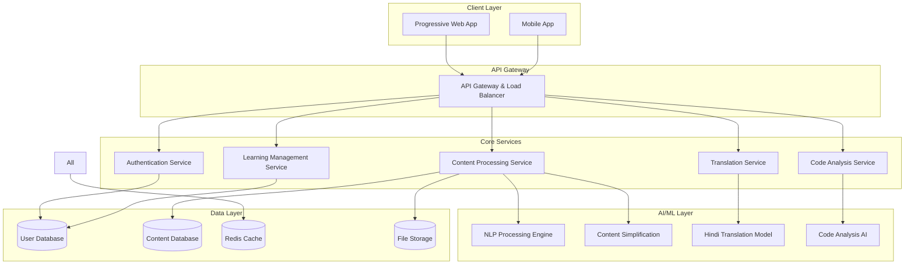

# Design Document: AI-Powered Learning Assistant

## Overview

The AI-powered learning and developer productivity assistant is designed as a scalable, multilingual platform that helps Indian students overcome language barriers and complexity in academic content. The system employs natural language processing, machine learning, and educational technology principles to provide personalized, culturally-aware learning experiences.

The platform follows a microservices architecture with offline-first capabilities, ensuring accessibility for users with limited connectivity and resources. The design emphasizes simplicity, cultural relevance, and educational effectiveness while maintaining technical robustness.

## Architecture

The system follows a distributed microservices architecture with the following key principles:

- **API-First Design**: All services communicate through well-defined REST APIs
- **Offline-First**: Progressive Web App with service workers for offline functionality
- **Microservices**: Independent, scalable services for different functional domains
- **Event-Driven**: Asynchronous processing for AI operations and user interactions
- **Multi-Tenant**: Support for multiple educational institutions and user groups

### High-Level Architecture



## Components and Interfaces

### 1. Content Processing Service

**Responsibility**: Handles content ingestion, processing, and simplification

**Key Interfaces**:
```typescript
interface ContentProcessor {
  simplifyContent(content: string, targetLevel: ReadabilityLevel): Promise<SimplifiedContent>
  extractConcepts(content: string): Promise<Concept[]>
  generateExamples(concept: Concept, culturalContext: string): Promise<Example[]>
}

interface SimplifiedContent {
  originalContent: string
  simplifiedText: string
  readabilityScore: number
  keyTerms: Term[]
  culturalExamples: Example[]
}
```

**Processing Pipeline**:
1. Content ingestion and format detection
2. Text extraction and preprocessing
3. Complexity analysis using readability metrics
4. AI-powered simplification with vocabulary replacement
5. Cultural context adaptation
6. Quality validation and caching

### 2. Translation Service

**Responsibility**: Handles multilingual translation and localization

**Key Interfaces**:
```typescript
interface TranslationEngine {
  translateText(text: string, sourceLang: Language, targetLang: Language): Promise<Translation>
  translateWithContext(text: string, domain: Domain, targetLang: Language): Promise<Translation>
  handleCodeMixed(text: string): Promise<ProcessedText>
}

interface Translation {
  translatedText: string
  confidence: number
  technicalTerms: TechnicalTerm[]
  alternativeTranslations: string[]
}
```

**Translation Features**:
- Context-aware translation for technical terms
- Preservation of code snippets and mathematical expressions
- Handling of Hindi-English code-mixed content
- Transliteration support for technical terms
- Cultural adaptation of examples and references

### 3. Code Analysis Service

**Responsibility**: Analyzes code, detects errors, and provides optimization suggestions

**Key Interfaces**:
```typescript
interface CodeAnalyzer {
  analyzeCode(code: string, language: ProgrammingLanguage): Promise<CodeAnalysis>
  explainError(error: CodeError): Promise<ErrorExplanation>
  suggestOptimizations(code: string): Promise<Optimization[]>
}

interface CodeAnalysis {
  errors: CodeError[]
  warnings: CodeWarning[]
  suggestions: Optimization[]
  complexity: ComplexityMetrics
  bestPractices: BestPractice[]
}
```

**Analysis Capabilities**:
- Static code analysis for syntax and logic errors
- Performance optimization suggestions
- Best practice recommendations
- Educational explanations for common mistakes
- Language-specific guidance for Python, Java, C++, JavaScript

### 4. Learning Management Service

**Responsibility**: Manages user progress, personalization, and adaptive learning

**Key Interfaces**:
```typescript
interface LearningManager {
  trackProgress(userId: string, activity: LearningActivity): Promise<void>
  generatePersonalizedContent(userId: string, topic: string): Promise<PersonalizedContent>
  createRevisionPlan(userId: string): Promise<RevisionPlan>
  assessKnowledge(userId: string, topic: string): Promise<KnowledgeAssessment>
}

interface PersonalizedContent {
  difficulty: DifficultyLevel
  preferredLanguage: Language
  culturalContext: CulturalContext
  learningStyle: LearningStyle
  recommendedResources: Resource[]
}
```

**Learning Features**:
- Adaptive difficulty adjustment based on user performance
- Personalized content recommendations
- Progress tracking and analytics
- Spaced repetition for revision
- Knowledge gap identification

## Data Models

### User Model
```typescript
interface User {
  id: string
  profile: UserProfile
  preferences: UserPreferences
  learningHistory: LearningActivity[]
  progress: ProgressTracker
}

interface UserProfile {
  name: string
  email: string
  educationLevel: EducationLevel
  institution?: string
  primaryLanguage: Language
  secondaryLanguages: Language[]
}

interface UserPreferences {
  preferredLanguage: Language
  difficultyLevel: DifficultyLevel
  culturalContext: CulturalContext
  learningStyle: LearningStyle
  notificationSettings: NotificationSettings
}
```

### Content Model
```typescript
interface Content {
  id: string
  type: ContentType
  originalText: string
  metadata: ContentMetadata
  processedVersions: ProcessedContent[]
  concepts: Concept[]
}

interface ProcessedContent {
  language: Language
  difficultyLevel: DifficultyLevel
  simplifiedText: string
  readabilityScore: number
  culturalAdaptations: CulturalAdaptation[]
}

interface Concept {
  id: string
  name: string
  definition: string
  examples: Example[]
  prerequisites: string[]
  difficulty: DifficultyLevel
}
```

### Learning Activity Model
```typescript
interface LearningActivity {
  id: string
  userId: string
  type: ActivityType
  content: string
  timestamp: Date
  duration: number
  performance: PerformanceMetrics
  feedback: UserFeedback
}

interface PerformanceMetrics {
  comprehensionScore: number
  timeToComplete: number
  errorsCount: number
  hintsUsed: number
  retryAttempts: number
}
```

## Technology Stack

### Frontend
- **Framework**: React with TypeScript for type safety and developer productivity
- **PWA**: Service Workers for offline functionality and caching
- **UI Library**: Material-UI with custom theming for Indian cultural preferences
- **State Management**: Redux Toolkit for predictable state management
- **Internationalization**: react-i18next for multilingual support
- **Mobile**: React Native for cross-platform mobile applications

### Backend Services
- **Runtime**: Node.js with Express.js for API services
- **Language**: TypeScript for type safety across the stack
- **API Gateway**: Kong or AWS API Gateway for request routing and rate limiting
- **Authentication**: JWT with refresh tokens, OAuth2 for social login
- **Message Queue**: Redis for caching and Bull for job processing

### AI/ML Stack
- **NLP Framework**: Hugging Face Transformers for text processing
- **Translation**: Custom fine-tuned models based on mT5 for Hindi-English translation
- **Content Simplification**: GPT-based models fine-tuned on educational content
- **Code Analysis**: Tree-sitter for parsing, custom models for error detection
- **Deployment**: TensorFlow Serving or Triton Inference Server

### Data Storage
- **Primary Database**: PostgreSQL for relational data with full-text search
- **Document Store**: MongoDB for flexible content storage
- **Cache**: Redis for session management and frequently accessed data
- **File Storage**: AWS S3 or Google Cloud Storage for content files
- **Search**: Elasticsearch for advanced content search and recommendations

### Infrastructure
- **Containerization**: Docker with Kubernetes for orchestration
- **Cloud Provider**: AWS or Google Cloud Platform for scalability
- **CDN**: CloudFlare for global content delivery and DDoS protection
- **Monitoring**: Prometheus with Grafana for metrics and alerting
- **Logging**: ELK Stack (Elasticsearch, Logstash, Kibana) for centralized logging

## Correctness Properties

Based on the acceptance criteria analysis, the following correctness properties must be validated through property-based testing:

### Property 1: Content Simplification Correctness
**Validates: Requirements 1.1, 1.2, 1.4, 1.5**

For any input content C and target readability level L:
- The simplified content S = simplify(C, L) must have readability_score(S) ≤ L
- The semantic similarity between C and S must be ≥ 0.8 (preserving meaning)
- All technical terms in C must either be replaced with simpler alternatives in S or accompanied by definitions
- The vocabulary complexity of S must be lower than C

```typescript
property("content simplification preserves meaning while reducing complexity", 
  forAll(content(), readabilityLevel(), (content, level) => {
    const simplified = contentProcessor.simplifyContent(content, level);
    return simplified.readabilityScore <= level &&
           semanticSimilarity(content, simplified.text) >= 0.8 &&
           vocabularyComplexity(simplified.text) < vocabularyComplexity(content);
  })
);
```

### Property 2: Translation Accuracy and Completeness
**Validates: Requirements 2.1, 2.2, 2.5**

For any text T translated from language L1 to L2:
- The translation accuracy must be ≥ 0.9 when compared to reference translations
- Technical terms must appear in both original and translated forms
- Code-mixed content must preserve both language components correctly

```typescript
property("translation maintains accuracy and handles technical terms", 
  forAll(technicalText(), (text) => {
    const translation = translationEngine.translateText(text, 'en', 'hi');
    const technicalTerms = extractTechnicalTerms(text);
    return translation.confidence >= 0.9 &&
           technicalTerms.every(term => 
             translation.translatedText.includes(term) || 
             translation.technicalTerms.some(t => t.original === term)
           );
  })
);
```

### Property 3: Code Analysis Completeness
**Validates: Requirements 4.1, 4.2, 4.4, 4.5**

For any code snippet C with known errors E:
- All errors in E must be detected by the analyzer
- Each optimization suggestion must improve at least one code quality metric
- Each recommendation must include an explanation
- Common beginner mistakes must be detected and explained educationally

```typescript
property("code analysis detects all errors and provides explanations", 
  forAll(codeWithKnownErrors(), (codeData) => {
    const analysis = codeAnalyzer.analyzeCode(codeData.code, codeData.language);
    const detectedErrors = analysis.errors.map(e => e.type);
    return codeData.expectedErrors.every(error => detectedErrors.includes(error)) &&
           analysis.suggestions.every(s => s.explanation.length > 0) &&
           analysis.suggestions.every(s => improvesCodeQuality(codeData.code, s.suggestedCode));
  })
);
```

### Property 4: Performance and Scalability
**Validates: Requirements 5.1, 5.5, 8.1, 8.2**

For any system load L and device capability D:
- Response time must be ≤ 3 seconds for L ≤ normal_load
- Data usage must be ≤ configured_limit for any operation
- System must handle concurrent users without service interruption
- Performance must degrade gracefully under high load

```typescript
property("system maintains performance under load", 
  forAll(systemLoad(), deviceCapability(), (load, device) => {
    const response = processRequest(generateRequest(), load, device);
    return (load <= NORMAL_LOAD ? response.time <= 3000 : true) &&
           response.dataUsage <= MAX_DATA_USAGE &&
           response.success === true;
  })
);
```

### Property 5: Data Security and Privacy
**Validates: Requirements 6.1, 6.2, 6.5**

For any user data D stored in the system:
- All personal data must be encrypted at rest and in transit
- User preferences and history must be persistently stored
- Backup and restore operations must preserve data integrity

```typescript
property("user data is encrypted and persistent", 
  forAll(userData(), (data) => {
    const stored = dataManager.storeUserData(data);
    const retrieved = dataManager.getUserData(data.userId);
    return isEncrypted(stored) &&
           dataIntegrity(data, retrieved) &&
           backupExists(data.userId);
  })
);
```

### Property 6: Multilingual Content Processing
**Validates: Requirements 2.3, 3.1, 3.4**

For any content C and user preferences P:
- Language switching must preserve content context
- Multi-layered explanations must be generated at different complexity levels
- Personalized content must adapt to user's learning history

```typescript
property("multilingual processing preserves context and personalizes content", 
  forAll(content(), userPreferences(), (content, prefs) => {
    const processed = learningManager.processContent(content, prefs);
    return processed.languages.includes(prefs.primaryLanguage) &&
           processed.explanationLevels.length >= 2 &&
           processed.personalization.basedOnHistory === true;
  })
);
```

## Implementation Strategy

### Phase 1: Core Infrastructure (Weeks 1-4)
- Set up development environment and CI/CD pipeline
- Implement basic authentication and user management
- Create API gateway and service discovery
- Set up databases and caching infrastructure
- Implement basic content ingestion and storage

### Phase 2: Content Processing Engine (Weeks 5-8)
- Develop content simplification algorithms
- Implement readability analysis and vocabulary replacement
- Create concept extraction and example generation
- Build cultural context adaptation system
- Integrate AI models for content processing

### Phase 3: Translation and Multilingual Support (Weeks 9-12)
- Implement Hindi-English translation engine
- Develop code-mixed content processing
- Create Devanagari script rendering support
- Build language switching functionality
- Integrate cultural localization features

### Phase 4: Code Analysis System (Weeks 13-16)
- Develop multi-language code parsing
- Implement error detection and explanation generation
- Create optimization suggestion engine
- Build educational guidance system
- Integrate with popular IDEs and editors

### Phase 5: Learning Management (Weeks 17-20)
- Implement progress tracking and analytics
- Develop personalization algorithms
- Create adaptive difficulty adjustment
- Build revision and spaced repetition system
- Implement knowledge assessment tools

### Phase 6: User Interface and Experience (Weeks 21-24)
- Develop responsive web application
- Create mobile applications for iOS and Android
- Implement offline functionality and PWA features
- Build accessibility features and keyboard navigation
- Conduct user testing and interface optimization

### Phase 7: Performance and Scalability (Weeks 25-28)
- Implement caching strategies and CDN integration
- Develop auto-scaling and load balancing
- Optimize AI model inference performance
- Build monitoring and alerting systems
- Conduct load testing and performance tuning

### Phase 8: Security and Compliance (Weeks 29-32)
- Implement data encryption and privacy controls
- Develop audit logging and compliance reporting
- Create data export and deletion functionality
- Conduct security testing and vulnerability assessment
- Ensure compliance with Indian data protection laws

## Testing Strategy

### Unit Testing
- **Coverage Target**: 90% code coverage for all services
- **Framework**: Jest for JavaScript/TypeScript, pytest for Python components
- **Focus Areas**: Business logic, data transformations, API endpoints
- **Mocking**: External services, AI models, and database interactions

### Integration Testing
- **API Testing**: Automated testing of all REST endpoints
- **Service Integration**: Testing communication between microservices
- **Database Testing**: Data persistence and retrieval operations
- **AI Model Testing**: Validation of model outputs and performance

### Property-Based Testing
- **Framework**: fast-check for TypeScript, Hypothesis for Python
- **Properties**: All correctness properties defined in this document
- **Generators**: Custom generators for educational content, code samples, user data
- **Shrinking**: Automatic minimization of failing test cases

### Performance Testing
- **Load Testing**: JMeter or Artillery for API load testing
- **Stress Testing**: Gradual load increase to find breaking points
- **Endurance Testing**: Extended testing periods to identify memory leaks
- **Scalability Testing**: Testing auto-scaling behavior under varying loads

### Security Testing
- **Penetration Testing**: Third-party security assessment
- **Vulnerability Scanning**: Automated scanning for known vulnerabilities
- **Data Protection Testing**: Encryption and privacy control validation
- **Authentication Testing**: JWT token security and session management

### User Acceptance Testing
- **Target Users**: Indian students and beginner developers
- **Testing Scenarios**: Real-world learning and coding scenarios
- **Accessibility Testing**: Screen readers, keyboard navigation, mobile devices
- **Cultural Appropriateness**: Validation of Indian cultural context and examples

## Deployment and Operations

### Deployment Strategy
- **Blue-Green Deployment**: Zero-downtime deployments with instant rollback capability
- **Canary Releases**: Gradual rollout to subset of users for risk mitigation
- **Feature Flags**: Runtime feature toggling for controlled feature releases
- **Database Migrations**: Automated, reversible database schema changes

### Monitoring and Observability
- **Application Metrics**: Response times, error rates, throughput
- **Business Metrics**: User engagement, learning progress, content effectiveness
- **Infrastructure Metrics**: CPU, memory, disk usage, network performance
- **AI Model Metrics**: Inference latency, accuracy, resource utilization

### Disaster Recovery
- **Backup Strategy**: Automated daily backups with point-in-time recovery
- **Multi-Region Deployment**: Geographic distribution for high availability
- **Failover Procedures**: Automated failover with manual override capability
- **Data Replication**: Real-time replication across availability zones

### Maintenance and Updates
- **Security Patches**: Automated security updates with testing validation
- **AI Model Updates**: Continuous model improvement and retraining
- **Content Updates**: Regular updates to cultural examples and educational content
- **Performance Optimization**: Ongoing performance monitoring and optimization

This design provides a comprehensive foundation for building a scalable, culturally-aware AI learning assistant that serves the specific needs of Indian students and beginner developers while maintaining high standards of performance, security, and educational effectiveness.
```

Now I need to use the prework tool to analyze the acceptance criteria before writing the Correctness Properties section.
